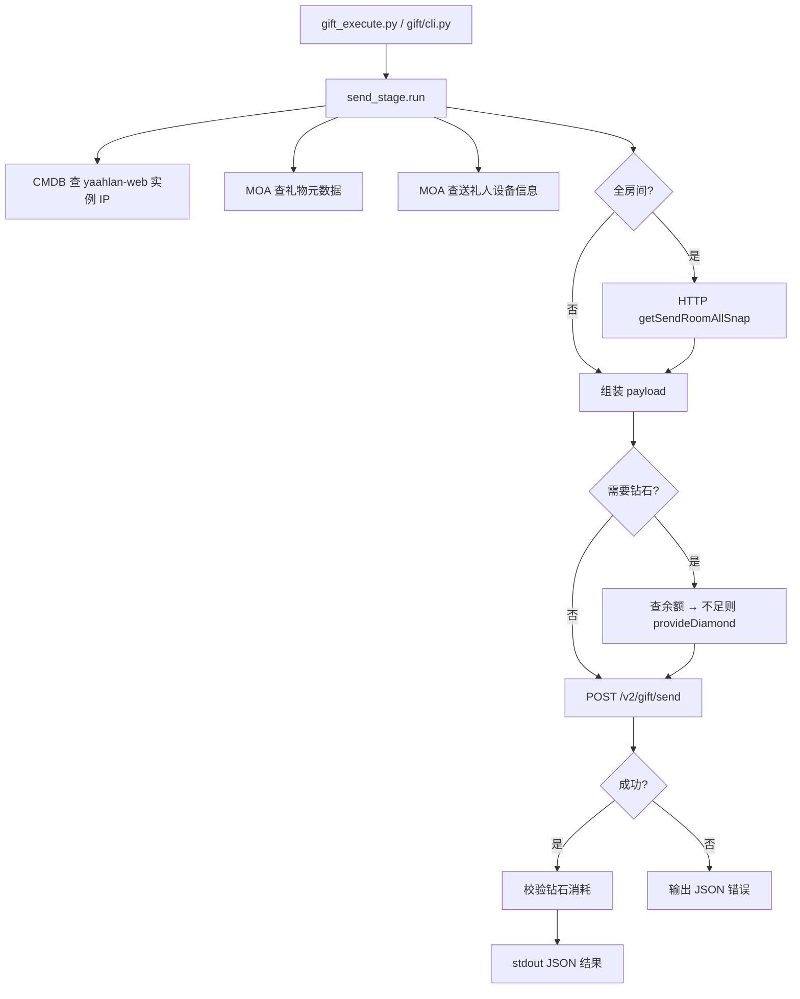

# Gift 模块 · Stage 测试环境送礼实现说明

> 文档生成时间：2026-07-16  
> 代码主文件：`Gift/gift/send_stage.py`  
> 统一入口：`python3 Gift/gift_execute.py`

---

## 1. 概述

Gift 模块在 **Stage（alpha/stage）测试环境** 直连 `yaahlan-web` 的 HTTP 接口完成送礼，不走客户端 UI，也不走 MOA 质量平台 httpproxy。

核心能力：

| 能力 | 说明 |
|------|------|
| 多场景送礼 | 房间内（chatroom）、私聊（private/im）、群组（group） |
| 全房间送礼 | 自动调 `getSendRoomAllSnap` 获取 snapId |
| 亲密申请送礼 | `ext.intimate_invite_gift=1`，用于 CP/挚友发起 |
| 自动补钻 | 送礼前查余额，不足则 MOA 充值并校验消耗 |
| 探测 / 预演 | `--probe` 只查依赖；`--dry-run` 只组装 payload |

**环境限制**：仅 Stage，禁止用于线上。

---

## 2. 架构与数据流



**一句话流程**：

```
CMDB 实例 IP → MOA 礼物 + 用户设备 → 组装 body →（可选补钻）→ POST /v2/gift/send → 校验消耗
```

---

## 3. 目录与入口

| 路径 | 职责 |
|------|------|
| `Gift/gift_execute.py` | 对外唯一 CLI 入口（薄包装） |
| `Gift/gift/cli.py` | 参数校验、异常转 JSON |
| `Gift/gift/send_stage.py` | **核心实现**（CMDB/MOA/HTTP/补钻） |
| `Gift/gift/env.py` | 加载 `Gift/.env.local` |
| `Gift/config/registry.json` | 工具台能力登记 |
| `.cursor/skills/stage-gift-send/SKILL.md` | Agent 使用规范 |

兼容路径：`Gift/scripts/send_gift_stage.py` → 转发到同一 `cli.main`。

---

## 4. 执行流程（逐步）

### 4.1 参数解析与校验

CLI 必填/互斥规则（`build_parser` + `cli.main` + `run`）：

| 参数 | 说明 |
|------|------|
| `--scene` | `chatroom` / `private` / `group` |
| `--sender` | 送礼人 userId |
| `--receivers` | 收礼人，逗号分隔（全房送礼时可省略） |
| `--gift-id` | 礼物 productId |
| `--scene-id` | chatroom=roomId，group=groupId；private 不需要 |
| `--num` | 数量，默认 1 |
| `--package-id` | HTTP Header，默认 `12321312` |
| `--send-room-all` | 仅 chatroom，自动 snap |
| `--intimate-invite` | 仅 private + 1 个 receiver |
| `--probe` / `--dry-run` | 探测 / 预演，不 POST |

校验要点：

- chatroom/group 必须带 `--scene-id`
- 非全房必须带 `--receivers`
- `--intimate-invite` 不能与 `--send-room-all` 同用

### 4.2 CMDB 查实例 IP

函数：`get_instance_ip()`

- URL：`http://cmdb.momo.com/open/hubble-app-instances/?appkey=momo.ibt.yaahlan.service.yaahlan-web&corp=alpha&env=stage`
- 鉴权：`Authorization: Token {CMDB_TOKEN}`
- Token 来源：环境变量 `CMDB_TOKEN` 或内置 fallback（`Gift/.env.local` 可覆盖）
- 取响应数组 `[0].instance_ip`，例如 `10.247.254.135`

### 4.3 MOA 调用机制

Gift **不走** `MOA/moa_execute.py` 质量平台，而是直连 **MOA Redis 协议**（与 `yaahlan-mcp queryMoaService_Stage` 同源）：

1. **Lookup**：对 `moa_lookup_alpha.momo.com:10010` 发 Redis GET  
   key = `{"action":"/service/lookup","params":{"m":"getService","args":["<serviceUri>","redis"]}}`
2. 从 `result.hosts` 解析 `10.x.x.x:port`（优先内网 10 段）
3. **调用**：对 provider 发 Redis GET  
   key = `{"action":"<serviceUri>","params":{"m":"<method>","args":[...]}}`

实现函数：`redis_get` → `lookup_provider` → `call_moa`

### 4.4 查礼物元数据

函数：`query_gift(gift_id)`

| 步骤 | ServiceUrl | method |
|------|------------|--------|
| 主路径 | `/service/mdp-gift/gift-query-service` | `batchQueryCategoryPropAndGifts` |
| 兜底 | 同上 | `batchQueryCategoryProps` |

返回字段映射（写入 HTTP body）：

| MOA 字段 | HTTP 用途 |
|----------|-----------|
| `category` | `category` |
| `giftType` / `giftSubType` | 映射为请求 `giftType`、`isPackage` |
| `price` | 计算钻石消耗 |
| `productName` | 日志/调试 |

`giftType` 映射规则（`map_request_gift_fields`）：

| 礼物类型 | giftType | isPackage |
|----------|----------|-----------|
| PROP_DEFAULT (2,0) | 2 | 0 |
| PACK_DEFAULT (1,0) | 0 | 1 |
| 普通礼物 | 0 | 0 |

### 4.5 查送礼人设备信息

函数：`query_user_device(sender)`

| 步骤 | ServiceUrl | method |
|------|------------|--------|
| 主路径 | `/service/voga-mts-user-profile-stage` | `getUserVersionInfo` |
| 兜底 | 同上 | `getUserInfoByFields` |

提取：`ua`、`deviceId`、`osType`、`lang`、`ip`、`appVersion`；并按 osType 补 `rom`/`model`（android/ios 默认值）。

### 4.6 全房间送礼（可选）

函数：`get_send_room_all_snap`

1. POST `http://{instance_ip}:8080/v2/gift/getSendRoomAllSnap`  
   body: `{sceneId, giftId, num}`
2. 取 `data.snapId` → 写入 payload 的 `sendRoomAllSnapId`
3. 不需要 `receivers` / `remoteIdList`；钻石消耗优先用 snap 返回的 `needDiamonds`

### 4.7 组装 HTTP 请求体

函数：`build_payload` + `build_ext`

**HTTP Headers**（`http_post`）：

```
userId: <sender>
package-id: <package-id，默认 12321312>
Content-Type: application/json
```

**Body 主要字段**：

| 字段 | 来源 |
|------|------|
| `appId` | 固定 2005 |
| `uid` | sender |
| `giftId` / `num` | CLI 参数 |
| `category` / `giftType` / `giftSubType` / `isPackage` | MOA 礼物查询 |
| `deviceId` / `ua` / `lang` / `ip` / `osType` / `rom` / `model` | MOA 用户设备 |
| `remoteIdList` | JSON 数组字符串（收礼人列表） |
| `sceneId` | roomId 或 groupId（private 亲密申请为空） |
| `ext` | 场景扩展 JSON 字符串 |
| `sendRoomAllSnapId` | 全房送礼时 |

**ext 按场景**（`build_ext`）：

| scene | ext.source | 额外字段 |
|-------|------------|----------|
| chatroom | `chatroom` | `room_id`, `receiverIds`, `giftNum`, `fromCursor` |
| group | `group` | `receiverIds`, `giftNum`, `fromCursor` |
| private | `im` | `receiverIds`, `giftNum`, `fromCursor` |
| intimate-invite | `p2p` | `intimate_invite_gift=1`, `feedId=""`, 无 receiverIds |

### 4.8 钻石自动补足与校验

仅当 `gift_needs_diamond(gift_meta)` 为真（非背包礼物且 price>0）时执行：

| 步骤 | 函数 | MOA |
|------|------|-----|
| 查余额 | `query_diamond_balance` | `/service/voga-base-service-middle-pay-stage` · `queryUserAccount` |
| 不足则充值 | `provide_diamond` | 同上 · `provideDiamond`（activityId/taskId/signKey 内置） |
| 送礼后校验 | `verify_diamond_consumed` | 再次 `queryUserAccount`，对比消耗是否等于 `gift_cost` |

钻石消耗计算（`compute_gift_diamond_cost`）：

```
gift_cost = price × num × receiver_count
```

全房送礼优先用 snap 的 `needDiamonds`。

### 4.9 POST 送礼

函数：`post_gift` → `http_post(instance_ip, "/v2/gift/send", ...)`

成功判定（`is_success_response`）：`success==true` 或 `ec in (0, 200)`。

---

## 5. 运行模式

| 模式 | 触发 | 行为 |
|------|------|------|
| **execute**（默认） | 无特殊 flag | 完整流程 + POST + 钻石校验 |
| **probe** | `--probe` | 只到 CMDB/MOA/组装 payload，不 POST |
| **dry-run** | `--dry-run` | 组装 payload 输出，不 POST、不补钻 |

---

## 6. stdout 输出 JSON

成功示例字段：

```json
{
  "ok": true,
  "mode": "execute",
  "instance_ip": "10.x.x.x",
  "gift_meta": { "category": "...", "giftType": 0, "price": 100, ... },
  "user_device": { "ua": "...", "deviceId": "...", "osType": "android", ... },
  "request": { "...": "实际 POST body" },
  "diamond": {
    "gift_cost": 100,
    "balance_before": 50,
    "topped_up": 100,
    "balance_before_send": 150,
    "after_send": { "consumed": 100, "verified": true }
  },
  "response": { "ec": 0, "em": "success", "data": { ... } }
}
```

失败示例：

```json
{
  "ok": false,
  "step": "post_gift",
  "error": "余额不足"
}
```

| 字段 | 含义 |
|------|------|
| `step` | 失败阶段（cmdb / moa_lookup / query_gift / diamond_provide / post_gift 等） |
| `snap` | 全房送礼 snap 信息 |
| `intimate_invite` | 是否亲密申请模式 |

---

## 7. 与其他模块的分工

| 模块 | 入口 | 用途 |
|------|------|------|
| **Gift（本模块）** | `Gift/gift_execute.py` | HTTP 级真实送礼，收礼方到账 |
| **MOA 背包** | `MOA/moa_execute.py --package-gift-*` | 仅给 sender 备货，不触发真实送礼 |
| **MOA-generative 亲密** | `form_intimate_pair.py` / 工作流 | Gift 发起 + MOA 同意闭环 |
| **ADB + Tunnel** | adb macro + tunnel | 客户端 UI 流程与抓包验收 |

亲密申请送礼在本模块内通过 `--intimate-invite` 实现；同意申请走 MOA `acceptIntimateInvitation`（见 `intimate-buddy-form` / `intimate-cp-form` 工作流）。

---

## 8. 常用命令

```bash
# 房间内送礼
python3 Gift/gift_execute.py \
  --scene chatroom --sender <sender> --receivers <uid1,uid2> \
  --gift-id <giftId> --scene-id <roomId> --num 1

# 私聊送礼
python3 Gift/gift_execute.py \
  --scene private --sender <sender> --receivers <receiver> \
  --gift-id <giftId>

# 全房间送礼
python3 Gift/gift_execute.py \
  --scene chatroom --sender <sender> --gift-id <giftId> \
  --scene-id <roomId> --send-room-all

# 亲密申请送礼
python3 Gift/gift_execute.py \
  --scene private --sender <sender> --receivers <receiver> \
  --gift-id <giftId> --intimate-invite

# 只探测依赖
python3 Gift/gift_execute.py --probe --scene private \
  --sender <sender> --receivers <receiver> --gift-id <giftId>
```

---

## 9. 配置与常量

| 项 | 值 |
|----|-----|
| appId | `2005` |
| CMDB appkey | `momo.ibt.yaahlan.service.yaahlan-web` |
| 环境 | `corp=alpha`, `env=stage` |
| 默认 package-id | `12321312` |
| MOA lookup | `moa_lookup_alpha.momo.com:10010` |
| HTTP 基址 | `http://{instance_ip}:8080` |
| 环境变量 | `Gift/.env.local` → `CMDB_TOKEN` |

---

## 10. 常见失败排查

| step | 可能原因 |
|------|----------|
| `cmdb` | Token 无效 / CMDB 无 stage 实例 |
| `moa_lookup` | lookup 无 provider / 网络不通 |
| `query_gift` | giftId 不存在 |
| `query_user` | sender userId 无设备信息 |
| `diamond_provide` | 充值后余额仍不足 |
| `post_gift` | 业务拒绝（余额、房间状态、礼物不可用等）读 `response.em` |
| `diamond_verify` | 送礼成功但扣钻数量与预期不符 |

---

## 11. 相关文档

- 工具台清单：`Gift/使用方法.md`（由 registry 自动生成）
- Agent Skill：`.cursor/skills/stage-gift-send/SKILL.md`
- 常量与 ext 模板：`.cursor/skills/stage-gift-send/reference.md`
