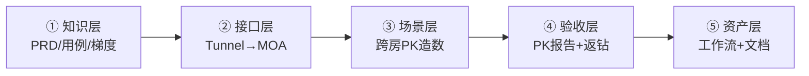

# PK 提款机：从零到 MOA 造数与自动化（2.5.9）

| 形式 | 地址 |
|------|------|
| **内网网页** | http://172.18.125.90:18766/keynote/pk-atm-guide |
| **本机网页** | http://127.0.0.1:18766/keynote/pk-atm-guide |

> 网页版由 `platform/web_agent/keynote/sync_pk_atm_guide.py` 同步；改本文后重跑该脚本即可刷新。

**本文档讲什么**：记录一次真实协作——从 **读 PRD、澄清规则**，到 **抓包落 MOA、对话里跑通场景**，再到 **把工作流沉淀为可一键重跑的自动化**。  
**本文档不讲什么**：脚本内部实现、API 字段字典、报告 JSON 结构（那些见仓库代码与 `workflow/使用方法.md`）。

**最终一键命令**（成果验证用）：

```bash
python3 workflow/workflow_execute.py run pk-atm-test
```

---

## 1. 核心思路：五层递进，不要一次写全

PK 提款机能力不是一句「帮我写自动化」出来的，而是按下面五层 **逐层提问、逐层验收**：



| 阶段 | 你要 AI 做到什么 | 你怎么问 | 典型产出 |
|------|------------------|----------|----------|
| ① 知识层 | AI **懂业务**，能回答门槛/梯度/边界 | 读 PRD、补梯度、生成用例 | `prd-kb/`、`temporary_testcase/PK提款机_2.5.9_测试用例.md` |
| ② 接口层 | AI **能调接口**，不靠手点 App | 抓包 → 记录 MOA | `MOA/templates/跨房PK-*.json`、`MOA-generative/mappings.md` |
| ③ 场景层 | 对话里 **跑通一场 PK** | 双号 + 机器人 + 送礼（分步修正） | 临时命令、`.tmp` 中间结果 |
| ④ 验收层 | 能 **断言发奖对不对** | 补「记 PK / 余额 / 应得钻 / 结束后再比差值」 | `workflow/scripts/pk_atm_test_run.py` |
| ⑤ 资产层 | **别人能复用** | 「结合到 PK 提款机测试」「整理学习文档」 | 工作流 `pk-atm-test`、本文档 |

**三条铁律**

1. **先对话跑通，再落库**——不要跳过 ③ 直接要脚本。  
2. **用修正句迭代**——C2「然后加机器人」比重写全文省力。  
3. **规则有「待确认」就显式列假设**——例如个人 PK 门槛，不要 silently 默认。

---

## 2. 阶段 ①：分析需求（不必写代码）

目标：让 AI 在造数之前，能回答「什么算提款机场次」「梯度怎么算」「哪些边界要测」。

### 2.1 实际提问顺序

| 顺序 | 你说了什么（要点） | 为什么要问 |
|------|-------------------|------------|
| A1 | 读取 2.5.9 PRD，生成知识库 | 统一术语与模块边界 |
| A2 | PK 提款机以前版本做过吗 | 定回归范围，避免重复造轮子 |
| A3 | （贴梯度表）不同阈值对应返奖比例 | 把表格变成可引用知识 |
| A4 | 个人获得奖励的门槛是多少 | 区分「场次门槛 vs 个人门槛」 |
| A5 | PK 提前结束怎么处理 | 准备阶段 / 认输 / 惩罚等边界 |
| A6 | 2.5.9 还有什么问题要处理 | 产出待确认清单 |
| A7 | 生成 2.5.9 PK 提款机全量用例 | 102 条用例 + 可导出钉钉 |

### 2.2 本阶段应搞清的业务要点（够用即可）

| 规则 | 要点 |
|------|------|
| 计入活动 | 仅 **跨房 PK · 随机匹配**；指定邀请 / 再来一局 **不计入** |
| 场次门槛 | 双方总 PK ≥ **50 万** 才有本场总奖金 |
| 梯度发奖 | 双方总 PK 命中梯度 → 定 **本场总奖金（钻）** |
| 个人瓜分 | 仅 **胜方**：`floor(个人 PK / 胜方总 PK × 本场总奖金)` |
| PK 换算 | 麦上送礼：**1 钻石 = 10 PK 值** |

全量用例：`temporary_testcase/PK提款机_2.5.9_测试用例.md`（PK_001～PK_102）。

### 2.3 本阶段提问模板

```text
读取{版本} PRD，生成知识库。
{粘贴梯度表} —— 请整理成表格并说明如何用于验收。
生成{功能}全量测试用例并导出钉钉表格。
{规则点} 在 PRD 里是否明确？不明确请列出待确认项和你的假设。
```

---

## 3. 阶段 ②：抓包 → 提供 MOA（一次一个接口）

目标：每个 HTTP 动作都有 **可重复执行的 MOA 模板**，后续造数不再依赖手点 App。

### 3.1 实际提问顺序

| 顺序 | 你说了什么（要点） | 产出 |
|------|-------------------|------|
| B1 | 抓包 13311111113 邀请 80949067 跨房 PK | Tunnel 链接 + body 字段说明 |
| B2 | 根据抓包生成 MOA | `applyAcrossRoomPk` 映射 |
| B3 | 13311111114 接受邀请，抓包并记录 MOA | `acceptAcrossRoomPkInvite` |
| B4 | 13311111113 结束 PK，抓包并记录 MOA | `closeAcrossRoomPk` |

### 3.2 提问格式（固定句式）

```text
抓包{手机号}{动作描述}的 tunnel，并记录到 MOA。
```

示例：

- `抓包13311111113邀请80949067跨房PK的tunnel，并记录到MOA`
- `13311111114接受跨房PK邀请，抓包并记录MOA`
- `13311111113结束PK，抓包并记录MOA`

### 3.3 操作习惯

| 习惯 | 原因 |
|------|------|
| **一次只录一个接口** | 避免 AI 批量猜 method，难验收 |
| 账号用 **手机号**，房间可只给 **roomId** | AI 会反查 userId |
| 录完让 AI **当场 MOA 执行一次** | 确认模板可用，而不只是落文件 |
| 跨房 PK 造数后期改用 **随机匹配** | 指定邀请常限频 / pending，且 **不计入提款机** |

### 3.4 本阶段产出清单

| 资产 | 用途 |
|------|------|
| `MOA/templates/跨房PK-指定邀请.json` | 发起 PK（探索用；提款机需随机匹配） |
| `MOA/templates/跨房PK-接受邀请.json` | 接受指定邀请 |
| `MOA/templates/跨房PK-结束PK.json` | 结束 PK |
| `MOA/templates/房间-增加机器人.json` | 麦上有人可收礼 |
| `MOA-generative/mappings.md` | room-pk-api 路径 ↔ method 登记 |

---

## 4. 阶段 ③④：对话里跑场景 → 补验收（迭代修正）

目标：在 **同一条 Web Agent 对话** 里，用自然语言把一场 PK 从头到尾跑通，并逐轮补上遗漏的前置与断言。

### 4.1 实际对话轮次（原文要点 → 修正了什么）

| 轮次 | 你的消息 | 修正了什么 |
|------|----------|------------|
| C1 | 13311111113/14 发起跨房 PK，20 秒后 20 账号两房随机送礼，结束 PK | **最小闭环**（先跑起来） |
| C2 | **然后**两房间麦上各加 5 机器人 | 补前置：麦上有人 |
| C3 | 送礼给 **麦上随机用户**，随机 **1～1000 钻**；全部送完后 **等 20 秒** 再结束 | 修正对象、金额、时序 |
| C4 | 结束时记录各房 PK、胜负、每用户贡献及 **占房间 PK 占比** | 补 **可读报告** |
| C5 | **把以上能力结合到 PK 提款机测试中** | 临时步骤 → **产品化意图** |
| C6 | 先拉配置 → 造 PK → 送礼 → 记 PK/余额/应得钻 → **再结束** → 校验钻石差值 | 补 **业务验收顺序**（结束前先快照余额） |

### 4.2 场景层推荐首问（模板①）

```text
{手机号A}和{手机号B}发起跨房PK，两房麦上各加{N}个机器人，
等待{T}秒后找{M}个测试账号在两房随机送礼（{礼物规则}），
{时序说明}后结束PK。
```

本次使用的具体值：**13311111113 / 13311111114**，**5** 机器人，**20** 秒，**20** 账号，Rose **1～1000 钻**。

### 4.3 增量修正句（最省力，直接复制）

**补送礼规则（C3）**

```text
送礼时给麦上随机用户随机赠送1到1000钻石的礼物，
全部送礼结束后，等待20秒再结束PK。
```

**补报告字段（C4）**

```text
结束时记录每个房间PK值、胜负、每个送礼用户贡献PK值及占所在房间总PK的占比。
```

**上升为提款机测试（C5）**

```text
把以上能力结合到PK提款机测试中。
```

**完整验收规格（C6，给 Agent 写脚本）**

```text
测试流程先获取服务配置得到整体和个人PK值门槛和返钻比例，
然后创建跨房PK上麦用户，用测试账号进行麦上送礼，
全部完成后记录双方房间总PK值以及每个送礼人各房间PK值，
记录每个人当前钻石余额和计算出的应得钻石数，
最后结束PK，获取每个人的钻石差值，验证是否和应得钻石预期相符。
```

### 4.4 造数时建议写死的参数

| 信息 | 本次取值 | 说明 |
|------|----------|------|
| 环境 | 测试环境 | 勿混用「线上环境」除非真要 online |
| 房主 A | 13311111113 → room 50861924 | AI 可反查 userId |
| 房主 B | 13311111114 → room 80949067 | 同上 |
| 匹配方式 | **随机匹配** | 提款机计入；指定邀请不计 |
| 机器人 | 每房 5 个上麦 | 修正句 C2 |
| 送礼 | 20 账号，麦上随机，1～1000 钻 | 修正句 C3 |
| 等待 | 加机器人后 20s；送完再 20s；结束后 8s 查钻 | 时序靠修正句明确 |

---

## 5. 阶段 ⑤：沉淀为可复用资产

当你说「结合到 PK 提款机测试」或「整理文档」时，可附加：

```text
请同时：1) 工作流落库并 record  2) 更新 registry  3) 写人读文档  4) 说明如何一键重跑
```

### 5.1 最终产出（给后来者对照）

| 类型 | 路径 |
|------|------|
| 一键工作流 | `workflow/workflows/pk-atm-test.json` → `python3 workflow/workflow_execute.py run pk-atm-test` |
| 执行脚本 | `workflow/scripts/pk_atm_test_run.py` |
| 默认梯度兜底 | `workflow/config/pk_atm_default_config.json`（配置 MOA 未映射时用） |
| 全量用例 | `temporary_testcase/PK提款机_2.5.9_测试用例.md` |
| PRD 摘要 | `prd-kb/房间PK.md` |
| 工具台 | `python3 platform/open_catalog.py` → 工作流 → **PK提款机-跨房PK造数验收** |

报告在 `.tmp/pk_atm_report_<pkId>.md`，跑完打开即可，不必先学 JSON 结构。

---

## 6. 怎么提问：好 vs 差

| 差 | 好 | 原因 |
|----|-----|------|
| 帮我测 PK 提款机 | 13311111113/14 随机匹配跨房 PK，…（见 §4.2 模板） | 缺账号、步骤、验收 |
| 写个自动化脚本 | 把以上能力结合到 PK 提款机测试中 | 先有对话内跑通 |
| 送礼测一下 | 给麦上随机用户 1～1000 钻 Rose，20 账号 | 缺对象、礼物、数量 |
| 查为什么没发奖 | 记录应得钻和实际钻石差值，验证是否相符 | 给可执行断言 |
| 一次录所有 PK 接口 | 13311111113 结束 PK，抓包并记录 MOA | 单接口易验收 |

### 每轮消息建议携带

| 信息 | 必填？ | 示例 |
|------|--------|------|
| 账号 | 造数必填 | 13311111113 / 13311111114 |
| 等待时间 | 强建议 | 20 秒 |
| 数量 | 强建议 | 5 机器人、20 送礼号 |
| 业务名 | 强建议 | PK 提款机、随机匹配 |
| 验收字段 | 写脚本时必填 | PK 值、占比、钻石差值 |

---

## 7. Web Agent / Cursor 协作

### 7.1 本次会话配置

```text
外部 Agent：服务端 Agent
未勾选 MDP Agent
batch_key=web:fe0181e7b6ce418e
```

| 选项 | 建议 | 说明 |
|------|------|------|
| **服务端 Agent** | 本场景首选 | MOA / Gift / Tunnel / 脚本 |
| MDP Agent | 非必须 | 偏客户端协议 |
| **延续当前对话** | 强建议 | C2～C6 修正句依赖前文 |

### 7.2 何时延续 vs 新开

| 场景 | 建议 |
|------|------|
| 修正送礼规则、补报告字段 | **延续**同一 batch |
| 全新无关功能 | 新对话 |
| 工作流已落库，只需重跑 | 「执行工作流 pk-atm-test」或直跑命令 |

### 7.3 人审节点（你自己过一眼）

1. **随机匹配 vs 指定邀请**：提款机必须随机匹配（`acrossPkType=1`）  
2. **梯度单位**：「800 万 PK」= 8,000,000  
3. **50 万门槛**：默认 20 笔小礼不够 → 预期返钻为 0 是否正常  
4. **个人门槛**：PRD 未定时，是否等产品确认再写死  
5. **配置接口**：MOA 未映射时，是否接受本地 JSON 兜底  

---

## 8. 半天复制路径（按顺序对 AI 说）

1. `读取2.5.9版本prd，生成知识库`  
2. `生成2.5.9 PK提款机全量测试用例`  
3. `抓包13311111113邀请80949067跨房PK并记录MOA`（接受 / 结束 PK 各一次）  
4. 粘贴 **§4.2 模板①**，跑通一场  
5. 粘贴 **§4.3 的 C3、C4 修正句**  
6. `把以上能力结合到PK提款机测试中`  
7. 粘贴 **§4.3 的 C6 完整验收句**  
8. `把从零分析需求、提供MOA、搭建自动化的过程整理成学习文档`  

验证：

```bash
python3 workflow/workflow_execute.py run pk-atm-test
```

冲 50 万梯度示例（对话跑通后再加压）：

```bash
python3 workflow/workflow_execute.py run pk-atm-test \
  --gift-count 120 --gift-min-diamonds 500 --gift-max-diamonds 1000
```

---

## 9. 过程里常见的坑（与怎么问才能避开）

| 现象 | 过程上怎么处理 |
|------|----------------|
| 指定邀请 ec=20210111 | 改问「**随机匹配**跨房 PK」 |
| 送礼了但 PK 不涨 | 修正句强调「送给 **麦上** 用户」+「等 20 秒」 |
| 预期返钻全是 0 | 先问「双方总 PK 是否达 50 万」；不够则加大 `--gift-count` |
| AI 一次写大脚本 | 回到 C1 最小闭环，再用 C2～C6 修正 |
| 配置接口调不通 | 显式说「先用本地梯度 JSON 兜底，后续再映射 MOA」 |

---

## 10. 变更记录

| 日期 | 说明 |
|------|------|
| 2026-08-03 | 初版：整合造数流程与工作流 |
| 2026-08-03 | 重构：以「从零 → MOA → 自动化」过程为主，实现细节下沉至代码 |
