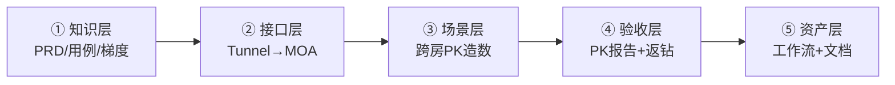
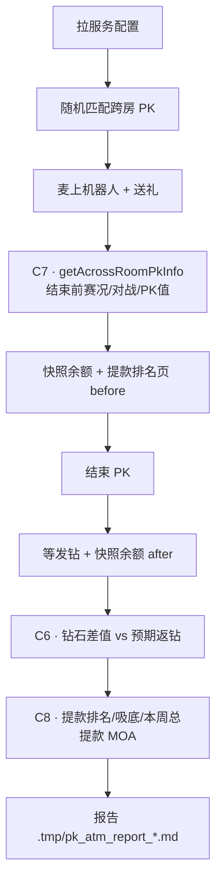

# PK 提款机：从零到 MOA 造数与自动化（2.5.9）

| 形式 | 地址 |
|------|------|
| **内网网页** | http://172.18.125.90:18766/keynote/pk-atm-guide |
| **本机网页** | http://127.0.0.1:18766/keynote/pk-atm-guide |

> 网页版由 `platform/web_agent/keynote/sync_pk_atm_guide.py` 同步；改本文后重跑该脚本即可刷新。

**本文档讲什么**：记录一次真实协作——从 **读 PRD、澄清规则**，到 **抓包落 MOA、对话里跑通场景**，再到 **把工作流沉淀为可一键重跑的自动化**。  
**本文档不讲什么**：脚本内部实现、API 字段字典、报告 JSON 结构（那些见仓库代码与 `workflow/使用方法.md`）。

**最终一键命令**（成果验证用）：

```bash
python3 workflow/workflow_execute.py run pk-atm-test
```

---

## 1. 核心思路：五层递进，不要一次写全

PK 提款机能力不是一句「帮我写自动化」出来的，而是按下面五层 **逐层提问、逐层验收**：



| 阶段 | 你要 AI 做到什么 | 你怎么问 | 典型产出 |
|------|------------------|----------|----------|
| ① 知识层 | AI **懂业务**，能回答门槛/梯度/边界 | 读 PRD、补梯度、生成用例 | `prd-kb/`、`temporary_testcase/PK提款机_2.5.9_测试用例.md` |
| ② 接口层 | AI **能调接口**，不靠手点 App | 抓包 → 记录 MOA | `MOA/templates/跨房PK-*.json`、`MOA-generative/mappings.md` |
| ③ 场景层 | 对话里 **跑通一场 PK** | 双号 + 机器人 + 送礼（分步修正） | 临时命令、`.tmp` 中间结果 |
| ④ 验收层 | 能 **断言发奖与页面数据** | C6 钻石差值；C7 结束前赛况 MOA；C8 结束后提款排名 MOA | `workflow/scripts/pk_atm_test_run.py` |
| ⑤ 资产层 | **别人能复用** | 「结合到 PK 提款机测试」「整理学习文档」 | 工作流 `pk-atm-test`、本文档 |

**三条铁律**

1. **先对话跑通，再落库**——不要跳过 ③ 直接要脚本。  
2. **用修正句迭代**——C2「然后加机器人」比重写全文省力。  
3. **规则有「待确认」就显式列假设**——例如个人 PK 门槛，不要 silently 默认。

---

## 2. 阶段 ①：分析需求（不必写代码）

目标：让 AI 在造数之前，能回答「什么算提款机场次」「梯度怎么算」「哪些边界要测」。

### 2.1 实际提问顺序

| 顺序 | 你说了什么（要点） | 为什么要问 |
|------|-------------------|------------|
| A1 | 读取 2.5.9 PRD，生成知识库 | 统一术语与模块边界 |
| A2 | PK 提款机以前版本做过吗 | 定回归范围，避免重复造轮子 |
| A3 | （贴梯度表）不同阈值对应返奖比例 | 把表格变成可引用知识 |
| A4 | 个人获得奖励的门槛是多少 | 区分「场次门槛 vs 个人门槛」 |
| A5 | PK 提前结束怎么处理 | 准备阶段 / 认输 / 惩罚等边界 |
| A6 | 2.5.9 还有什么问题要处理 | 产出待确认清单 |
| A7 | 生成 2.5.9 PK 提款机全量用例 | 102 条用例 + 可导出钉钉 |

### 2.2 本阶段应搞清的业务要点（够用即可）

| 规则 | 要点 |
|------|------|
| 计入活动 | 仅 **跨房 PK · 随机匹配**；指定邀请 / 再来一局 **不计入** |
| 场次门槛 | PRD：**双方总 PK ≥ 50 万**；**alpha 实测 MSE** 见 §2.4（当前 **2 万**） |
| 梯度发奖 | 双方总 PK 命中梯度 → 按 **返钻比例 %** 计算本场总奖金（alpha 见 §2.4） |
| 个人瓜分 | 仅 **胜方**：个人 PK ≥ 个人门槛（alpha **1 千**）且 `floor(个人 PK / 胜方总 PK × 本场总奖金)` |
| PK 换算 | 麦上送礼：**1 钻石 = 10 PK 值** |
| 首胜翻倍 | alpha MSE 已开：`firstWinMultiplier = 2` |

全量用例：`temporary_testcase/PK提款机_2.5.9_测试用例.md`（PK_001～PK_102）。用例按 PRD 梯度编写；**造数验收以 MSE 为准**（§2.4）。

### 2.3 本阶段提问模板

```text
读取{版本} PRD，生成知识库。
{粘贴梯度表} —— 请整理成表格并说明如何用于验收。
生成{功能}全量测试用例并导出钉钉表格。
{规则点} 在 PRD 里是否明确？不明确请列出待确认项和你的假设。
```

### 2.4 服务配置（MSE alpha · pkAtmConfig）

**来源**：MSE `voga-common` / `pkAtmConfig`，cluster/env/region 均为 **alpha**；appKey `momo.bpm.biz.gameplatform.overseas-voga-mts-room`。  
**最后更新**：2026-08-07（v-chen.mo）。  
**钉钉单表**：[PK提款机-pkAtmConfig-20260807](https://alidocs.dingtalk.com/i/nodes/oP0MALyR8k7Aow9wCY9wvqBd83bzYmDO)（Agent 导出目录，单 Sheet「活动配置」）。

拉取命令：

```bash
python3 MSE/mse_execute.py \
  --namespace voga-common --config-key pkAtmConfig \
  --cluster alpha --env alpha --region alpha --output json

# 写入 / 刷新钉钉表格（新建）
python3 platform/dingtalk_gateway/pk_atm_mse_to_workbook.py \
  --workbook-name "PK提款机-pkAtmConfig-YYYYMMDD"

# 覆盖已有表格（推荐更新时用）
python3 platform/dingtalk_gateway/pk_atm_mse_to_workbook.py \
  --workbook-url "https://alidocs.dingtalk.com/i/nodes/oP0MALyR8k7Aow9wCY9wvqBd83bzYmDO"
```

#### 基础参数（alpha 当前值）

| 键 | 值 | 说明 |
|----|-----|------|
| `enabled` | `true` | 活动总开关 |
| `longTermEnabled` | `true` | 长期活动 |
| `startTime` / `endTime` | 2026-01-01 ～ 2026-12-31 | 活动期 |
| `dailyStartHour` / `dailyEndHour` | 0 / 24 | 每日时段 |
| **`minTotalPkValue`** | **20,000** | 场次总 PK 门槛（PRD 50 万，测试环境已下调） |
| **`minMemberRewardPk`** | **1,000** | 个人瓜分 PK 门槛 |
| `broadcastMinDiamond` | 1,000 | 广播最低钻石 |
| `firstWinEnabled` | `true` | 首胜翻倍开关 |
| **`firstWinMultiplier`** | **2** | 首胜倍数 |

#### 梯度表 `matchPoolGradients`（双方总 PK ≥ 左列 → 返钻比例）

| minTotalPkValue | returnRatioPercent |
|-----------------|-------------------|
| 20,000 | 3% |
| 100,000 | 3% |
| 400,000 | 4% |
| 1,000,000 | 5% |
| 2,000,000 | 5% |
| 5,000,000 | 6% |

#### 发钻配置 `diamondDispatchConfig`

| 键 | 值 |
|----|-----|
| `activityId` | `2005005017` |
| `activityTaskId` | `2005005019` |
| `activitySign` | `7e5721b379b14962a38f9d2e81376605` |

**与工作流关系**：`pk_atm_test_run.py` 优先 MOA 拉运行时配置；拉不到时用 `workflow/config/pk_atm_default_config.json`（PRD 梯度兜底）。验收前可 `--min-combined-pk 20000 --personal-pk-threshold 1000` 对齐 alpha MSE。

---

## 3. 阶段 ②：抓包 → 提供 MOA（一次一个接口）

目标：每个 HTTP 动作都有 **可重复执行的 MOA 模板**，后续造数不再依赖手点 App。

### 3.1 实际提问顺序

| 顺序 | 你说了什么（要点） | 产出 |
|------|-------------------|------|
| B0 | **13311111112 / 13311111113 同时发起随机匹配**跨房 PK | 双房 `applyAcrossRoomPk`（`acrossPkType=1`）+ 配对成功 |
| B1 | 抓包 13311111113 **发起随机匹配**的 tunnel | Tunnel `_id=VmdPzJ8BR2LVRzbvVZwa` + MOA 随机匹配模板 |
| B2 | 根据抓包生成 MOA | `applyAcrossRoomPk` 映射（随机匹配 + 指定邀请两条） |
| B3 | （探索）13311111113 邀请 80949067 跨房 PK | 指定邀请模板；**不计入提款机** |
| B4 | 13311111114 接受邀请 / 13311111113 结束 PK，抓包 | `acceptAcrossRoomPkInvite` / `closeAcrossRoomPk` |

### 3.2 提问格式（固定句式）

```text
抓包{手机号}{动作描述}的 tunnel，并记录到 MOA。
```

示例：

- `13311111112和13311111113同时发起跨房PK随机匹配`
- `抓包13311111113发起跨房PK随机匹配的tunnel，并记录到MOA`
- `抓包13311111113邀请80949067跨房PK的tunnel，并记录到MOA`（探索用，非提款机计入）
- `13311111113结束PK，抓包并记录MOA`

### 3.3 操作习惯

| 习惯 | 原因 |
|------|------|
| **一次只录一个接口** | 避免 AI 批量猜 method，难验收 |
| 账号用 **手机号**，房间可只给 **roomId** | AI 会反查 userId |
| 录完让 AI **当场 MOA 执行一次** | 确认模板可用，而不只是落文件 |
| 跨房 PK 造数 **默认随机匹配** | 指定邀请常限频 / pending，且 **不计入提款机**；两房先后 `applyAcrossRoomPk`（`acrossPkType=1`）即可配对 |

### 3.4 本阶段产出清单

| 资产 | 用途 |
|------|------|
| `MOA/templates/跨房PK-随机匹配.json` | **提款机造数**：双房随机匹配（`acrossPkType=1`，`acrossRoomId=""`） |
| `MOA-generative/templates/example-applyAcrossRoomPk-random-match.body.json` | 生成式 MOA 随机匹配 body 示例 |
| `MOA/templates/跨房PK-指定邀请.json` | 探索 / 指定邀请（**不计入提款机**） |
| `MOA/templates/跨房PK-接受邀请.json` | 接受指定邀请 |
| `MOA/templates/跨房PK-结束PK.json` | 结束 PK |
| `MOA/templates/房间-增加机器人.json` | 麦上有人可收礼 |
| `MOA-generative/mappings.md` | room-pk-api 路径 ↔ method 登记 |

### 3.5 随机匹配 MOA 要点（Tunnel 实测）

| 字段 | 随机匹配 | 指定邀请 |
|------|----------|----------|
| HTTP | `/yaahlan/room/acrossRoomPk/applyAcrossRoomPk` | 同左 |
| MOA | `/service/room/external/room-pk-api` + `applyAcrossRoomPk` | 同左 |
| `acrossPkType` | `"1"` | `"2"` |
| `acrossRoomId` | `""`（空） | 目标 roomId |
| `pkMinute` | `5` / `10` / `30` | 同左 |
| Tunnel 样例 | `100079102` `_id=VmdPzJ8BR2LVRzbvVZwa`（2026-08-04） | `_id=ZPxoxp8Bpk1mjMPPZg6N` |

单步 MOA（随机匹配）：

```bash
python3 MOA/moa_execute.py --payload-file MOA/templates/跨房PK-随机匹配.json

python3 workflow/workflow_execute.py run moa-generative-run \
  --service-url /service/room/external/room-pk-api \
  --method applyAcrossRoomPk \
  --body-file MOA-generative/templates/example-applyAcrossRoomPk-random-match.body.json \
  --strict 0
```

**配对习惯**：两房几乎同时进入匹配池（工作流内 A 房 apply → 等 1 秒 → B 房 apply）；实测 **13311111112**（room `31668628`）与 **13311111113**（room `50861924`）约 5～60 秒可配成一对。

---

## 4. 阶段 ③④：对话里跑场景 → 补验收（迭代修正）

目标：在 **同一条 Web Agent 对话** 里，用自然语言把一场 PK 从头到尾跑通，并逐轮补上遗漏的前置与断言。

### 4.1 实际对话轮次（原文要点 → 修正了什么）

| 轮次 | 你的消息 | 修正了什么 |
|------|----------|------------|
| C1 | **13311111112/13 随机匹配**跨房 PK，20 秒后 20 账号两房随机送礼，结束 PK | **最小闭环**（提款机计入路径） |
| C2 | **然后**两房间麦上各加 5 机器人 | 补前置：麦上有人 |
| C3 | 送礼给 **麦上随机用户**，随机 **1～1000 钻**；全部送完后 **等 20 秒** 再结束 | 修正对象、金额、时序 |
| C4 | 结束时记录各房 PK、胜负、每用户贡献及 **占房间 PK 占比** | 补 **可读报告** |
| C5 | **把以上能力结合到 PK 提款机测试中** | 临时步骤 → **产品化意图** |
| C6 | 先拉配置 → 造 PK → 送礼 → 记 PK/余额/应得钻 → **再结束** → 校验钻石差值 | 补 **业务验收顺序**（结束前先快照余额） |
| C7 | PK 结束前还要测 **PK 赛况页**：对战信息与 PK 值展示正确；用 **生成式 MOA** 模拟请求（赛况列表接口后续抓包补充） | 补 **结束前 UI 数据层验收**（不等结束 PK 才断言） |
| C8 | PK 结束后测 **提款排名**：榜单序、吸底「本周已提款」、页头「本周已被提走奖金」与钻石增量一致；用 **生成式 MOA**（接口后续抓包补充） | 补 **结束后排名/汇总数据层验收** |

### 4.2 场景层推荐首问（模板①）

```text
{手机号A}和{手机号B}同时发起跨房PK随机匹配，两房麦上各加{N}个机器人，
等待{T}秒后找{M}个测试账号在两房随机送礼（{礼物规则}），
{时序说明}后结束PK。
```

本次使用的具体值：**13311111112 / 13311111113**（或 **13311111113 / 13311111114**），**5** 机器人，**20** 秒，**20** 账号，Rose **1～1000 钻**，PK 时长 **5 分钟**（`--pk-minute 5`）。

### 4.3 增量修正句（最省力，直接复制）

**补送礼规则（C3）**

```text
送礼时给麦上随机用户随机赠送1到1000钻石的礼物，
全部送礼结束后，等待20秒再结束PK。
```

**补报告字段（C4）**

```text
结束时记录每个房间PK值、胜负、每个送礼用户贡献PK值及占所在房间总PK的占比。
```

**上升为提款机测试（C5）**

```text
把以上能力结合到PK提款机测试中。
```

**完整验收规格（C6，给 Agent 写脚本）**

```text
测试流程先获取服务配置得到整体和个人PK值门槛和返钻比例，
然后创建跨房PK上麦用户，用测试账号进行麦上送礼，
全部完成后记录双方房间总PK值以及每个送礼人各房间PK值，
记录每个人当前钻石余额和计算出的应得钻石数，
最后结束PK，获取每个人的钻石差值，验证是否和应得钻石预期相符。
```

**PK 赛况页验收（C7，结束前 · 生成式 MOA）**

```text
PK结束前还要测试PK赛况页面展示PK中的信息，
房间对战信息和PK值展示正确，用生成式MOA模拟请求测试（后续补充赛况列表接口）。
```

工作流 `pk-atm-test` 已内置（`workflow/scripts/pk_atm_test_run.py`）：

**开启跨房 PK（仅随机匹配）**：脚本 `_begin_random_match_cross_room_pk` 会

1. 清理残留：`closeAcrossRoomPk`（若两房已在 PK）→ 双向 `rejectAcrossRoomPkInvite` → `cancelAcrossRoomPkMatch`（尽力）
2. **两房并行** `applyAcrossRoomPk`（`acrossPkType=1`）
3. **匹配失败**（apply 失败 / 超时）→ 清理 → 重新发起（默认 `--match-retries 5`）
4. **配错房间**（对手 roomId ≠ 期望）→ 立刻 `closeAcrossRoomPk` → 清理 → 重新发起
5. 轮询直到两房互配成功（每轮 `--match-timeout 90`）
6. 报告 `.md` 含 **「随机匹配开启跨房 PK」** 章节（apply ec、pkId、重试轮次）

| 验收层 | MOA | 当前状态 |
|--------|-----|----------|
| **对战信息与 PK 值** | `getAcrossRoomPkInfo`（room-pk-api） | 已映射，**默认必验** |
| **活动页赛况列表** | `across-room-pk-withdraw-v2-api` 等候选 | **待抓包**；测试环境 MSE 可能未注册；默认跳过，加 `--require-pk-situation-list` 可强制 |

结束前验收项（对战 MOA）：

- `stage` 在 PK 中/惩罚阶段（2～3），非准备/已结束
- 双方 `roomId`、房间名/头像与 Admin 解析一致
- `roomRankValue` / `acrossRoomRankValue` 双方视角一致
- 报告 `.tmp/pk_atm_report_<pkId>.md` 含「PK 赛况与对战验收」章节

单步 MOA（调试）：

```bash
python3 MOA-generative/scripts/run_generative_moa.py \
  --url /service/room/external/room-pk-api \
  --method getAcrossRoomPkInfo \
  --body-file MOA-generative/templates/example-getAcrossRoomPkInfo.body.json \
  --strict 0
```

赛况 **列表** tab 待抓包后登记 `MOA-generative/mappings.md`（句式：`抓包13311111113打开PK提款机赛况tab的tunnel，并记录到MOA`）。

**提款排名验收（C8，结束后 · 生成式 MOA）**

```text
PK结束后还要测试PK提款排名，总排名的用户提款钻石数增加正确，排名正确，
所有用户查看吸底钻石数增加正确，PK提款机本周总提款钻石数正确，
用生成式MOA模拟请求测试（后续补充）。
```

| 验收层 | 字段/规则 | 当前状态 |
|--------|-----------|----------|
| **榜单序** | 前 50 名按当周领取钻石降序（PK_060～PK_066） | MOA 待抓包；映射后自动验 |
| **吸底** | 「本周已提款💎y」增量 = 本场钻石到账 Δ（PK_067～PK_068） | 同上；各送礼账号各拉一次 |
| **本周总提款** | 页头「本周已被提走奖金」增量 = 本场全员发钻之和（PK_012～PK_013） | 同上 |
| **兜底** | 钱包钻石差值 = 预期返钻 | 已实现（C6） |

结束 PK **前**快照排名页 → 发钻等待 → **后**再拉 MOA 对比。接口未映射时 MOA 层跳过、不阻断工作流；`--require-withdraw-rank-api` 可强制。

抓包句式：`抓包13311111113打开PK提款机提款排名tab的tunnel，并记录到MOA`

### 4.5 工作流验收全景（C6 → C7 → C8）

`pk-atm-test` 一键脚本内的 **时序**（对话里用 C6/C7/C8 修正句逐轮补全）：



| 阶段 | 修正句 | MOA / 断言 | 接口状态 |
|------|--------|------------|----------|
| **C6** | 结束前先记余额，结束后再比钻石差值 | 钱包 query_diamond | 已有 |
| **C7** | PK 结束前测赛况页对战信息与 PK 值 | `getAcrossRoomPkInfo` | **已映射**；赛况列表 tab 待抓包 |
| **C8** | PK 结束后测提款排名、吸底、本周总提款 | withdraw 排名系列候选 | **待抓包**；默认跳过 MOA 层 |

报告章节对应关系：

| 报告章节 | 来源 |
|----------|------|
| 随机匹配开启跨房 PK | 工作流匹配步骤 |
| PK 赛况与对战验收 | C7 |
| 送礼人 PK 与钻石验收 | C6 |
| 提款排名验收 | C8 |

### 4.4 造数时建议写死的参数

| 信息 | 本次取值 | 说明 |
|------|----------|------|
| 环境 | 测试环境 | 勿混用「线上环境」除非真要 online |
| 房主 A | 13311111113 → room 50861924 | AI 可反查 userId |
| 房主 B | 13311111112 → room 31668628（或 13311111114 → 80949067） | 同上 |
| 匹配方式 | **随机匹配**（`acrossPkType=1`） | 工作流默认；指定邀请不计入提款机 |
| PK 时长 | `--pk-minute 5`（可选 10/30） | 工作流参数 `pkMinute` |
| 机器人 | 每房 5 个上麦 | 修正句 C2 |
| 送礼 | 20 账号，麦上随机，1～1000 钻 | 修正句 C3 |
| 等待 | 加机器人后 20s；送完再 20s；结束后 8s 查钻 | 时序靠修正句明确 |

---

## 5. 阶段 ⑤：沉淀为可复用资产

当你说「结合到 PK 提款机测试」或「整理文档」时，可附加：

```text
请同时：1) 工作流落库并 record  2) 更新 registry  3) 写人读文档  4) 说明如何一键重跑
```

### 5.1 最终产出（给后来者对照）

| 类型 | 路径 |
|------|------|
| 一键工作流 | `workflow/workflows/pk-atm-test.json` → `python3 workflow/workflow_execute.py run pk-atm-test` |
| 执行脚本 | `workflow/scripts/pk_atm_test_run.py`（随机匹配开 PK + C6/C7/C8 验收） |
| 默认梯度兜底 | `workflow/config/pk_atm_default_config.json`（PRD 梯度；MOA 未映射时用） |
| MSE 配置导出 | `platform/dingtalk_gateway/pk_atm_mse_to_workbook.py` → 钉钉单表 §2.4 |
| 随机匹配 MOA | `MOA/templates/跨房PK-随机匹配.json`、`MOA-generative/templates/example-applyAcrossRoomPk-random-match.body.json` |
| 赛况 MOA 模板 | `MOA-generative/templates/example-getAcrossRoomPkInfo.body.json` |
| MOA 映射表 | `MOA-generative/mappings.md`（已验证 + 待抓包候选） |
| 全量用例 | `temporary_testcase/PK提款机_2.5.9_测试用例.md` |
| PRD 摘要 | `prd-kb/房间PK.md` |
| 工具台 | `python3 platform/open_catalog.py` → 工作流 → **PK提款机-跨房PK造数验收** |

报告在 `.tmp/pk_atm_report_<pkId>.md`，跑完打开即可。重点章节：**PK 赛况与对战验收**（C7）、**送礼人 PK 与钻石验收**（C6）、**提款排名验收**（C8）。

---

## 6. 怎么提问：好 vs 差

| 差 | 好 | 原因 |
|----|-----|------|
| 帮我测 PK 提款机 | 13311111112/13 **随机匹配**跨房 PK，…（见 §4.2 模板） | 缺账号、步骤、验收 |
| 写个自动化脚本 | 把以上能力结合到 PK 提款机测试中 | 先有对话内跑通 |
| 送礼测一下 | 给麦上随机用户 1～1000 钻 Rose，20 账号 | 缺对象、礼物、数量 |
| 查为什么没发奖 | 记录应得钻和实际钻石差值，验证是否相符 | 给可执行断言 |
| 一次录所有 PK 接口 | 13311111113 结束 PK，抓包并记录 MOA | 单接口易验收 |

### 每轮消息建议携带

| 信息 | 必填？ | 示例 |
|------|--------|------|
| 账号 | 造数必填 | 13311111112 / 13311111113（或 13/14） |
| 等待时间 | 强建议 | 20 秒 |
| 数量 | 强建议 | 5 机器人、20 送礼号 |
| 业务名 | 强建议 | PK 提款机、随机匹配 |
| 验收字段 | 写脚本时必填 | PK 值、占比、钻石差值 |

---

## 7. Web Agent / Cursor 协作

### 7.1 本次会话配置

```text
外部 Agent：服务端 Agent
未勾选 MDP Agent
batch_key=web:fe0181e7b6ce418e
```

| 选项 | 建议 | 说明 |
|------|------|------|
| **服务端 Agent** | 本场景首选 | 查 room-pk-api / `applyAcrossRoomPk` 等 **后端实现**；Token 配在 `platform/dingtalk_gateway/.env.local` 的 `YAAHLAN_SERVICE_AGENT_TOKEN` |
| MDP Agent | 非必须 | 偏客户端协议 |
| **延续当前对话** | 强建议 | C2～C8 修正句依赖前文 |

勾选服务端 Agent 后，Web Agent 调用 `service_agent_query.py` 时，对话区会显示 **「服务端 Agent 查询中（已 N 秒）…」** 进度行（与「已收到 / 执行中 / 已用时」同区）。

### 7.2 何时延续 vs 新开

| 场景 | 建议 |
|------|------|
| 修正送礼规则、补报告字段、补赛况/排名验收 | **延续**同一 batch |
| 全新无关功能 | 新对话 |
| 工作流已落库，只需重跑 | 「执行工作流 pk-atm-test」或直跑命令 |

### 7.3 人审节点（你自己过一眼）

1. **随机匹配 vs 指定邀请**：提款机必须随机匹配（`acrossPkType=1`）  
2. **梯度单位**：「800 万 PK」= 8,000,000  
3. **场次门槛**：PRD 50 万；**alpha MSE 当前 2 万**（§2.4）— 默认 20 笔小礼在 alpha 可能已达标  
4. **个人门槛**：alpha MSE **1 千 PK**（§2.4）；PRD 未定时以 MSE 为准  
5. **赛况 / 排名 MOA**：未抓包前 C7/C8 的 MOA 层会跳过，以钻石差值兜底是否正常  

---

## 8. 半天复制路径（按顺序对 AI 说）

1. `读取2.5.9版本prd，生成知识库`  
2. `生成2.5.9 PK提款机全量测试用例`  
3. `抓包13311111113发起跨房PK随机匹配并记录MOA`（结束 PK 抓包一次）  
4. 粘贴 **§4.2 模板①**（两号**随机匹配**），跑通一场  
5. 粘贴 **§4.3 的 C3、C4 修正句**  
6. `把以上能力结合到PK提款机测试中`  
7. 粘贴 **§4.3 的 C6 完整验收句**  
8. 粘贴 **§4.3 的 C7 赛况页验收句**（生成式 MOA · 结束前）  
9. 粘贴 **§4.3 的 C8 提款排名验收句**（生成式 MOA · 结束后）  
10. `把从零分析需求、提供MOA、搭建自动化的过程整理成学习文档`  

验证：

```bash
python3 workflow/workflow_execute.py run pk-atm-test \
  --phone-a 13311111112 --phone-b 13311111113
```

冲梯度示例（alpha 2 万门槛，对话跑通后再加压）：

```bash
python3 workflow/workflow_execute.py run pk-atm-test \
  --phone-a 13311111112 --phone-b 13311111113 \
  --min-combined-pk 20000 --personal-pk-threshold 1000 \
  --gift-count 40 --gift-min-diamonds 100 --gift-max-diamonds 500
```

冲 PRD 50 万梯度（需大幅加压，仅对照用例文档）：

```bash
python3 workflow/workflow_execute.py run pk-atm-test \
  --phone-a 13311111112 --phone-b 13311111113 \
  --gift-count 120 --gift-min-diamonds 500 --gift-max-diamonds 1000
```

---

## 9. 过程里常见的坑（与怎么问才能避开）

| 现象 | 过程上怎么处理 |
|------|----------------|
| 指定邀请 ec=20210111 | 改 **随机匹配**；工作流会先清理 pending 再 apply |
| 随机匹配长时间不配 | 加大 `--match-timeout` / `--match-retries`；确认两房并行 apply；换空闲测试号 |
| 配到其他房间 | 脚本自动 `closeAcrossRoomPk` 后重试；报告会记 wrongMatch 轮次 |
| 服务端 Agent 401 | 更新 `YAAHLAN_SERVICE_AGENT_TOKEN`（浏览器登录 ai-yaahlan 后复制 Bearer） |
| 送礼了但 PK 不涨 | 修正句强调「送给 **麦上** 用户」+「等 20 秒」 |
| 预期返钻全是 0 | 先对照 §2.4 MSE 门槛（alpha **2 万** / 个人 **1 千**）；不够则加大 `--gift-count` |
| AI 一次写大脚本 | 回到 C1 最小闭环，再用 C2～C8 修正 |
| 配置接口调不通 | 显式说「先用本地梯度 JSON 兜底」并 `--min-combined-pk` / `--personal-pk-threshold` 对齐 MSE |
| C7/C8 MOA 报 Method not found | 正常：排名/赛况列表 tab **待抓包**；先验收 C6 钻石差值，抓包后再 `--require-*` 强制 |

---

## 10. 变更记录

| 日期 | 说明 |
|------|------|
| 2026-08-03 | 初版：整合造数流程与工作流 |
| 2026-08-03 | 重构：以「从零 → MOA → 自动化」过程为主，实现细节下沉至代码 |
| 2026-08-04 | C7：PK 结束前生成式 MOA 验收赛况/对战信息与 PK 值；赛况列表接口待抓包 |
| 2026-08-04 | C8：PK 结束后提款排名/吸底/本周总提款 MOA 验收框架；排名 tab 接口待抓包 |
| 2026-08-04 | 工作流改为 **随机匹配开 PK**（清理→双房 apply→轮询配对）；新增 `--pk-minute` |
| 2026-08-04 | MOA：随机匹配模板 + Tunnel `_id=VmdPzJ8BR2LVRzbvVZwa`；实测 13311111112/13 可配对 |
| 2026-08-04 | Web Agent：服务端 Agent 查询进度展示；Token 配置说明 |
| 2026-08-07 | §2.4：MSE alpha `pkAtmConfig` 入文档（门槛 2 万 / 个人 1 千 / 6 档梯度）；钉钉单表导出命令 |
| 2026-08-07 | 随机匹配：失败/配错房间自动重试（并行 apply + close 错配 + `--match-retries`） |
